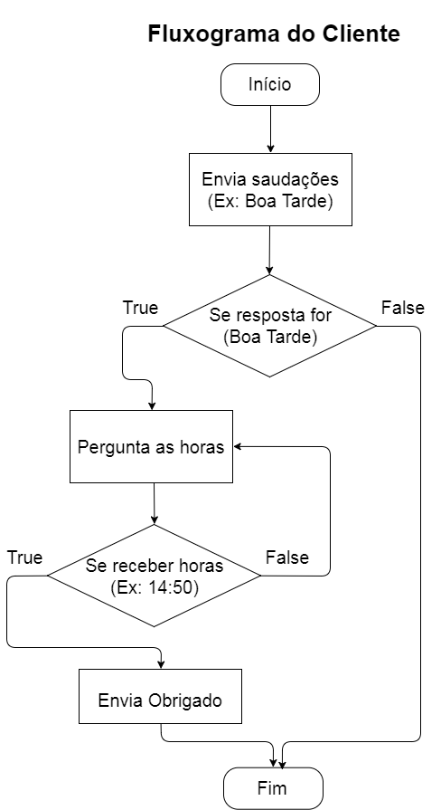
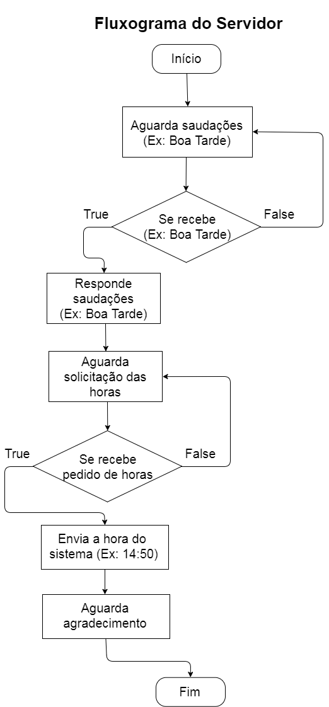

# Trabalho de Redes 2017.1

## Para compilar:
- Terminal do Servidor:
```
  gcc -c tcpserver.c -o server -pthread
```
- Terminal do Cliente:
```
  gcc -c tcpclient.c -o client -pthread
```

## Para rodar:
- Terminal do Servidor:
```
  ./server
```
- Terminal do Cliente:
```
  ./client <server_ip_address>
```

## Sobre

- João Pedro Rodrigues
- Jefferson Brito

1. Trabalho Prático 1:
Cada dupla de alunos será responsável por implementar um exemplo de protocolo humano (seguindo o fluxograma a baixo) usando a API socket TCP ou UDP na linguagem de programação de sua escolha.
A dupla será encarregada de implementar a aplicação Cliente e Servidor.
O Cliente solicita (ao servidor) as informações sobre o seu horário atual do sistema.
O Servidor aguarda e responde as solicitações que chegam.
Observação: Códigos iguais, entre duplas, não serão aceitos (evite copiar código)!

 
